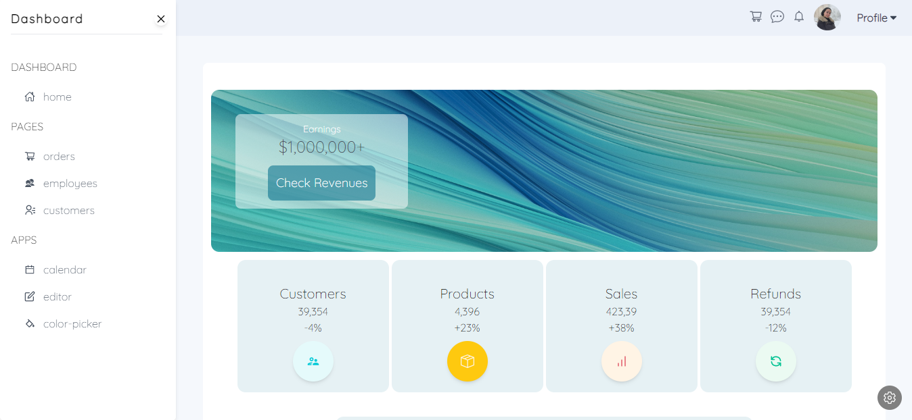
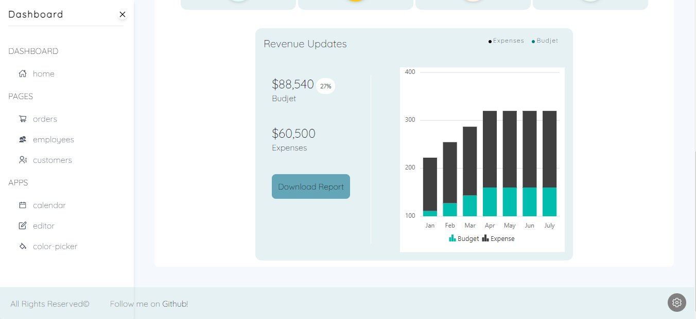

# Building React dashboard
## Setup 
1. create react app `npx create-react-app .` .
2. delete unnecessary files inside **src** folder and keep **index.js/index.css** and **app.js/app.css** .
3. import `import ReactDOM from 'react-dom';` in **index.js** file --> to hook your react application to the real dom.

> Note

when creating a react application your installing two main packages: **react** which is responsible for:
- the logic part of each components.
- building components and their structure.
- states and hooks..

the other one is **react dom**, which is mainly responsible for reflecting what react does to the user, and it consists of a **virtual dom** and a **real dom**:
- any updates or changes that happens is reflected on the virtual dom first.
- then once the updated component is specified, the changes happen on th real dom.

this means that the real dom does not get re-built on every update which optimizes the work of the app.

- Run the application `npm start` .
________
## Dependencies 
After setting up your project, you have to install some dependencies, and for that you can copy any extra dependency in the following content of **package.json** and paste it in your own file.

[Package.json](https://github.com/adrianhajdin/project_syncfusion_dashboard/blob/main/package.json)

- To make sure you have installed all right dependencies, run `npm install --legacy-peer-deps`

### Syncfusion
A modern JavaScript UI toolkit that has been built from the ground up to be lightweight, responsive, modular and touch friendly. It is written in TypeScript and has no external dependencies.

[syncfusion documentation](https://help.syncfusion.com/)

### Tailwind CSS 
Follow the steps in here starting from step#2 to install the Tailwind CSS framework for styling.. don't forget to import it in the **index.css** file!

[Tailwind CSS](https://tailwindcss.com/docs/guides/create-react-app)

- Check **App.css** file to implement basic styling before you start.
_____

## Code
### Structure
All of the folders are going to be in the project folder **src**
- **components** 
- **contexts** --> to use react context api
- **pages** --> like components but, in components floder, a component cannot be rendered or used inside another, unlike pages folder, where it holds component that can include more componenets.
- **data** --> will include images and demo data to use in the entire application

You can download the below zipped file to your **data** folder:
[data example](https://minhaskamal.github.io/DownGit/#/home?url=https:%2F%2Fgithub.com%2Fadrianhajdin%2Fproject_syncfusion_dashboard%2Ftree%2Fmain%2Fsrc%2Fdata)

- **dummy.js** file --> contains a collection of arrays and objects that represent the data like positions and charts, titles and descriptions, we will import it in most components. 

### App.js
- Starting with the main file, import: useEffect hook from react, browser router, routes and route from react-router-dom.
- import a tool Tip Component from syncfusion `import { TooltipComponent } from '@syncfusion/ej2-react-popups'` .
- start with the code [From here](./src/App.js)

### Components
In the **components** folder you can add a charts folder, as well as any other **jsx** component.
Start creating these components:
- Navbar
- Sidebar
- ThemeSettings
- Footer

> Note

You have to export the components in order to use them globaly, so you can create an **index.jsx** inside the **component** and **pages** folders and export each file like this: `export { default as Sidebar } from './Sidebar';`
[Components](./src/components/)

### Pages
Same as the components exports, you have to create an **index.jsx** file, as well as the charts folder and some other pages
[Pages](./src/pages/)
_____

## Upcoming
- Sidebar auto closing after clicking, according to screen width
- More charts using SyncFusion
_____

## Demo

____
## Resources
- [https://www.youtube.com/watch?v=jx5hdo50a2M&list=PLquu0CWhh4T7r9eKhvbhv44BFP0pCXFVC&index=39&t=75s&ab_channel=JavaScriptMastery](https://www.youtube.com/watch?v=jx5hdo50a2M&list=PLquu0CWhh4T7r9eKhvbhv44BFP0pCXFVC&index=39&t=75s&ab_channel=JavaScriptMastery)
- [https://github.com/adrianhajdin/project_syncfusion_dashboard](https://github.com/adrianhajdin/project_syncfusion_dashboard)
- [Sidebar transition](https://www.w3schools.com/howto/howto_js_sidenav.asp)
- [Dropdown menu](https://tailwindui.com/components/application-ui/elements/dropdowns)
- [React icons](https://react-icons.github.io/react-icons)